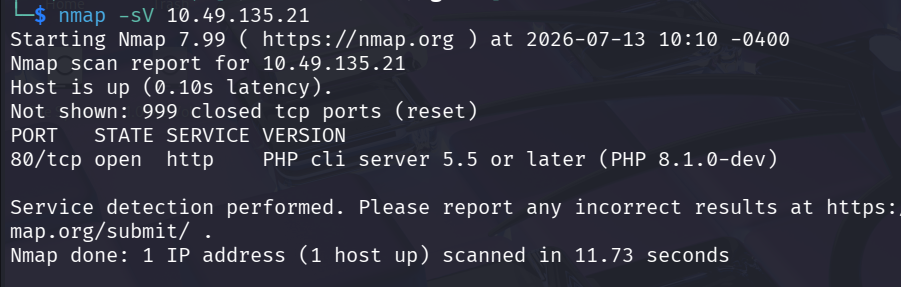
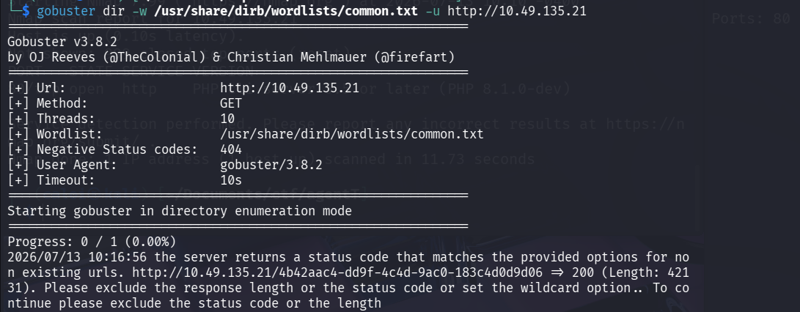
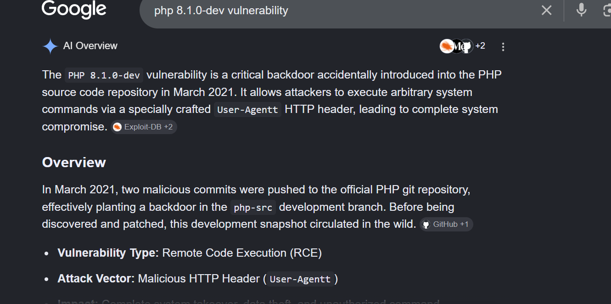
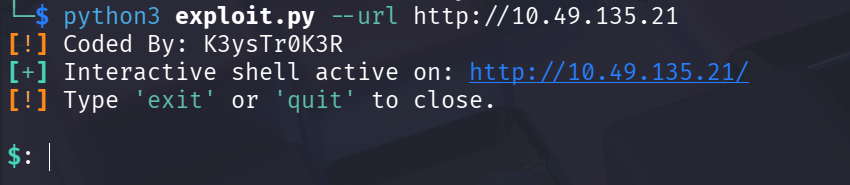
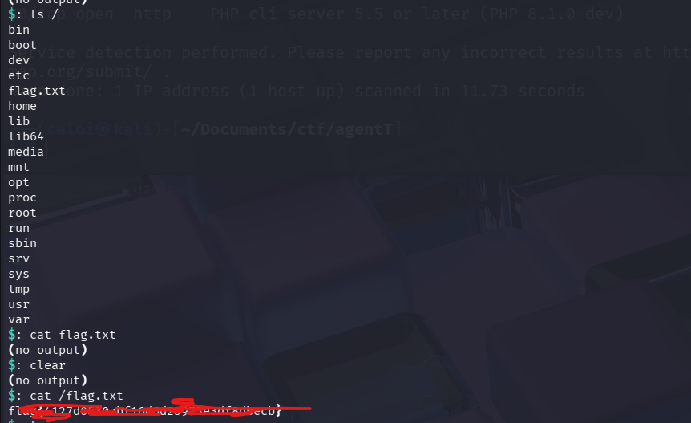

# Title: Agent T

**Category:** Red

**Difficulty:** Easy

## 1. Reconnaissance

As always I start by running an nmap scan against the target to reveal open ports, running services and its versions

```bash
nmap -sV (target-ip)
```

Only one port is open and its port 80 which means its running a web application. Also its running PHP 8.1.0 let us keep that in mind for later.



When exploring the web, we landed in an admin dashboard which is unusual because we rarely see a challenge where we are given a foothold already.


## 2. Enumeration

While exploring the web unfortunately it was a static website. There were other pages available, even its sources have nothing interested. 

At first I suspected that the search function might be vulnerable to OS command injection but even that did not work. So I ran gobuster against the web application to see if there might be any interesting directories.

```bash
gobuster dir -w /usr/share/dirb/wordlists/common.txt -u http://target-ip/
```

Unfortunately we did not get any interesting results.


What's left is to check if its PHP version is vulnerable to any known cve's

## 3. Exploitation

While searching the web for PHP 8.1.0's known vulnerability and we hit a jackpot. This specific version is known to be vulnerable to backdoor rce.



I then looked on the internet for a known PoC and downloaded it into my machine to use it against the target.

```link
https://github.com/K3ysTr0K3R/PHP-8.1.0-dev-Backdoor
```

```bash
git clone https://github.com/K3ysTr0K3R/PHP-8.1.0-dev-Backdoor
```

After downloading the PoC I then proceed to run it against the target to gain remote code execution.

```bash
python3 exploit.py --url http://target-ip
```



We know have access to the system

## 4. Retrieving the flag.

While we're in the machine we could not navigate outside the web directory. Luckily we can still read the / directory where the flag is located

```bash
cat /flag.txt
```

