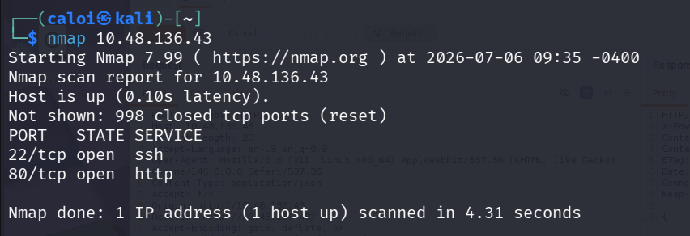
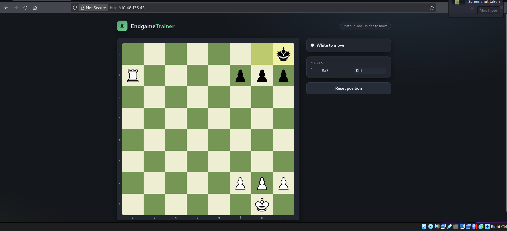
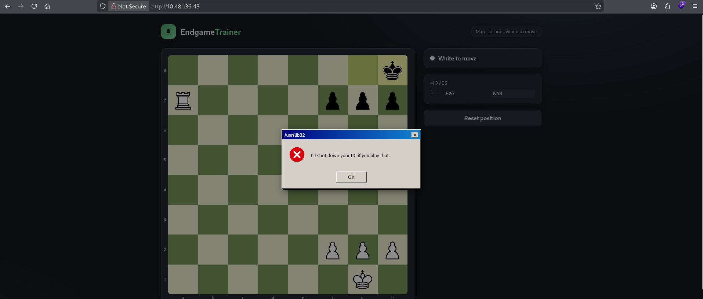
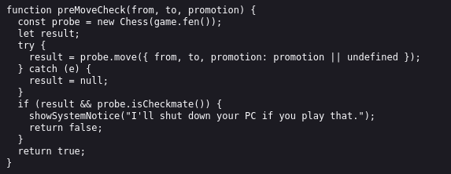
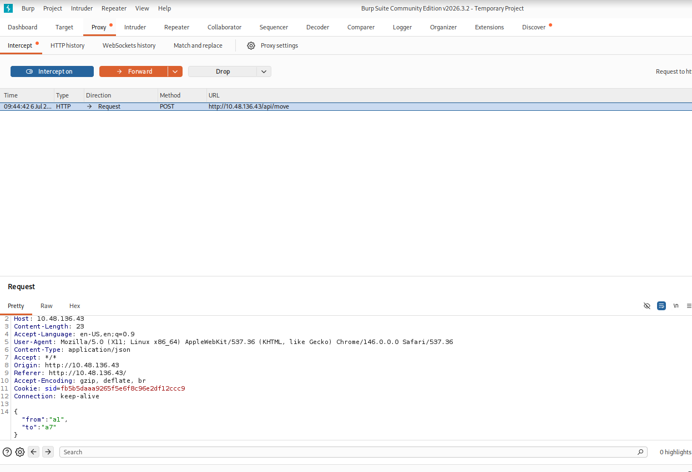
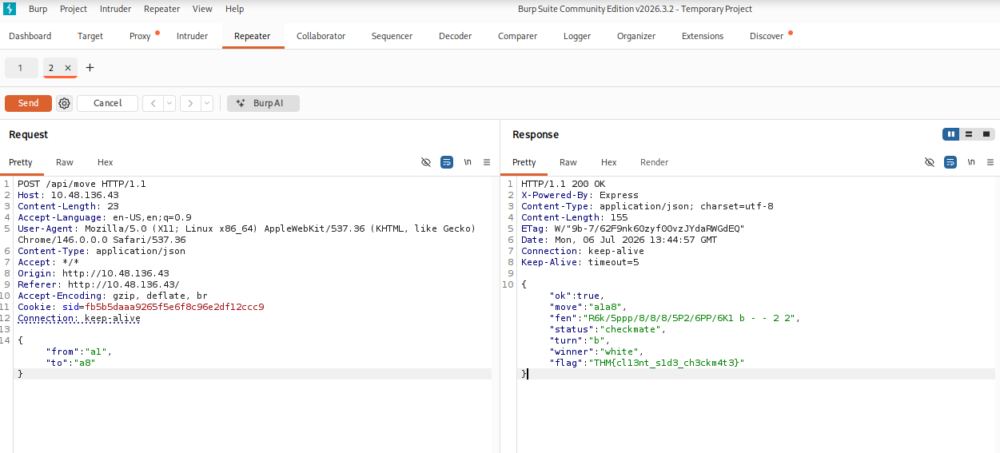

# Title: Fools Mate CTF
**Difficulty:** Easy
**Category:** Red

## 1. Reconnaissance 
After getting the IP {10.48.136.43} the first thing every ethical hacker should do is the reconnaissance phase. I start by running an Nmap scan on the target IP and found two ports open. Port 22 ssh and port 80 HTTP.

Okay so now since we know that the IP is hosting a website lets open it in the browser.

## 2. Exploring the Web App
It seems we got a chess game website here, we are able to move chess pieces and reset the game

But when we tried to checkmate the opponent, it greets as an error message. This is interesting.

## 3. Reviewing the Source Code
Inspecting the page source reveals that the JavaScript file `app.js` contains the logic responsible for processing the move.

view-source:http://10.48.136.43/js/app.js

## 4. Bypassing Client-side Validation 
Lets launch burp suite so that we can bypass this client-side check.

First we generate a request by interacting with the website while the burpsuite intercept it.

We then send it to the repeater and replace a7 to a8.

Just like that we were able to retrieve the flag.