# Title: Gaming Server

**Difficulty:** Easy

**Category:** Red

## 1. Recon

I started by running an Nmap scan against the target to identify the open ports and running services.

```bash
nmap -sV <target-ip>
```

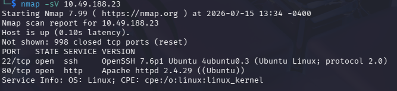

The scan revealed that an Apache web server was running. I then opened the target's website and was greeted with a webpage themed around an RPG game.

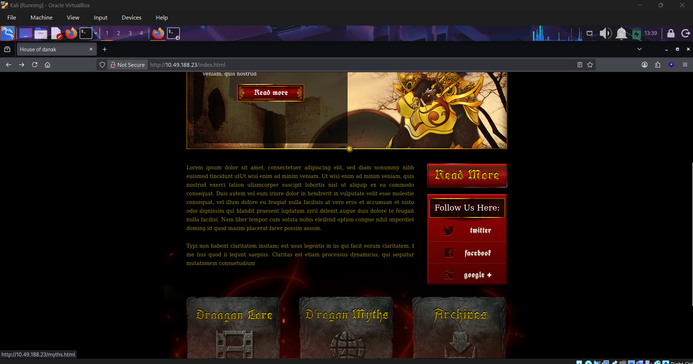

While exploring the website, I came across an upload element. My initial thought was that it might be vulnerable to a file upload vulnerability. However, clicking on it instead revealed a directory listing.

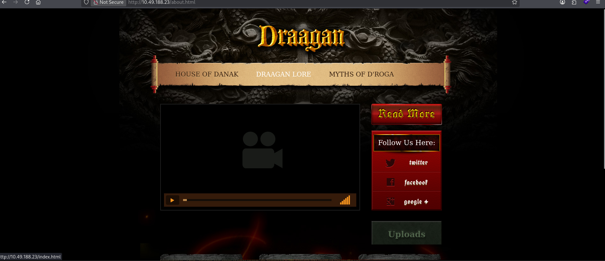

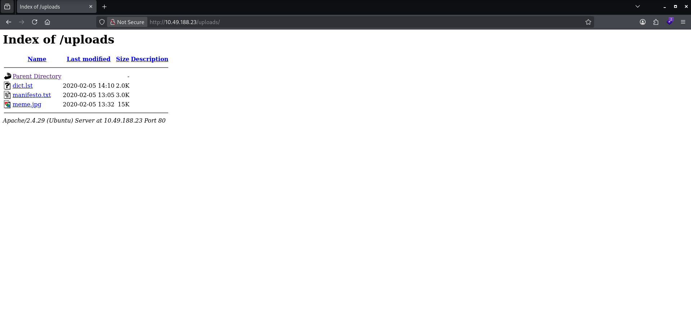

Browsing through the directory, I found a file named `dict.lst`, so I downloaded it to my machine.

```bash
wget http://<target-ip>/uploads/dict.lst
```

The file contained a list of random words that appeared to be a custom wordlist. This suggested that it might be useful later for brute-forcing credentials or passphrases, so I kept it in mind for later use.

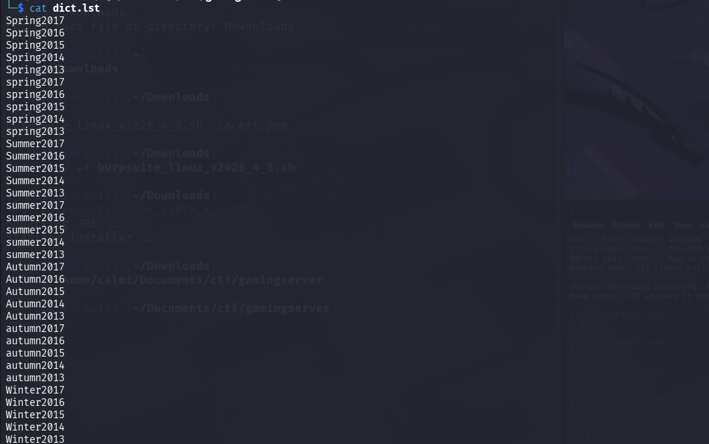

I continued exploring the website and found an interesting comment in the page's source code mentioning a developer named **john**. This suggested that a user named `john` might exist on the system and could potentially be used for SSH access later.

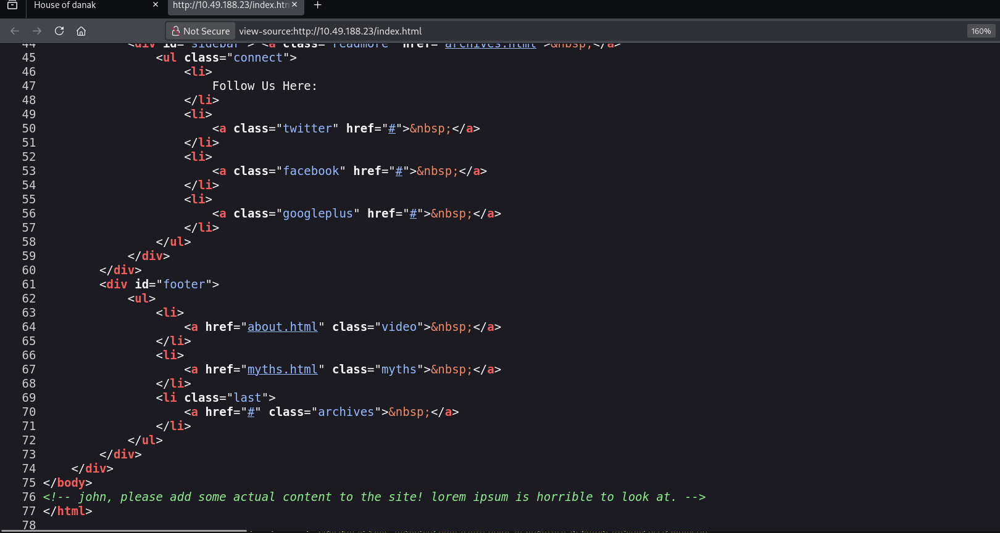

---

## 2. Directory Enumeration

Next, I used Gobuster to enumerate hidden directories on the web server.

```bash
gobuster dir -w /usr/share/dirb/wordlists/common.txt -u http://target-ip/
```

After fuzzing the website, Gobuster discovered another directory named `secret`.

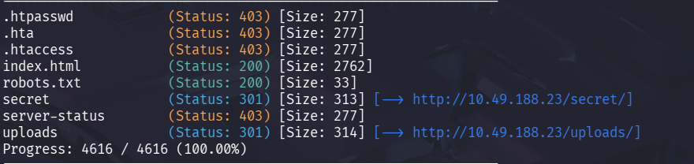

Visiting the endpoint revealed another directory listing that contained an RSA private key. I downloaded the key to my machine for further analysis.

```bash
wget http://target-ip/secret/secretKey
```

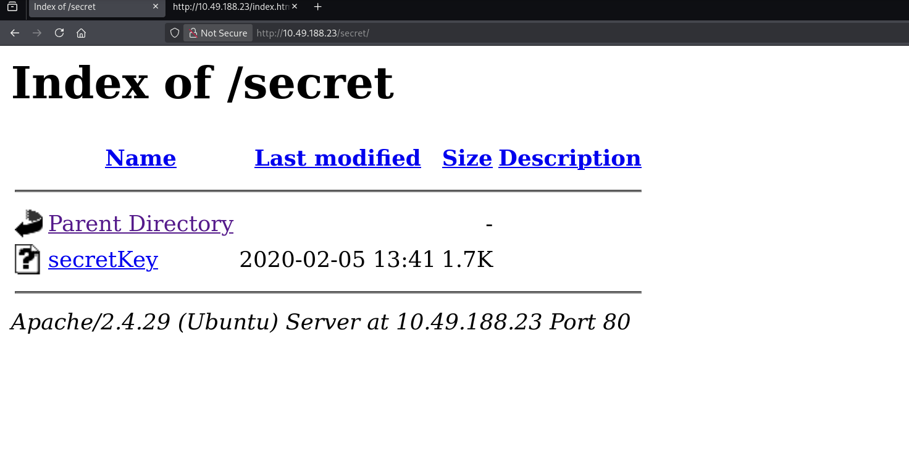

---

## 3. Exploitation

At this point, I had both a potential username (`john`) and an RSA private key, so I attempted to log in via SSH.

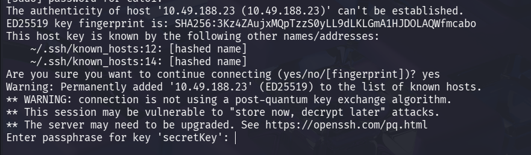

The login attempt failed because the RSA key was protected with a passphrase. To recover it, I used John the Ripper.

First, I converted the RSA key into a format that John the Ripper could understand using `ssh2john`.

```bash
ssh2john secretKey > hashedkey
```

I then attempted to crack the resulting hash using the RockYou wordlist.

```bash
john --wordlist=/usr/share/wordlists/password/rockyou.txt hashedkey
```

The passphrase was successfully recovered as `letmein`, allowing me to authenticate and log into the machine via SSH.

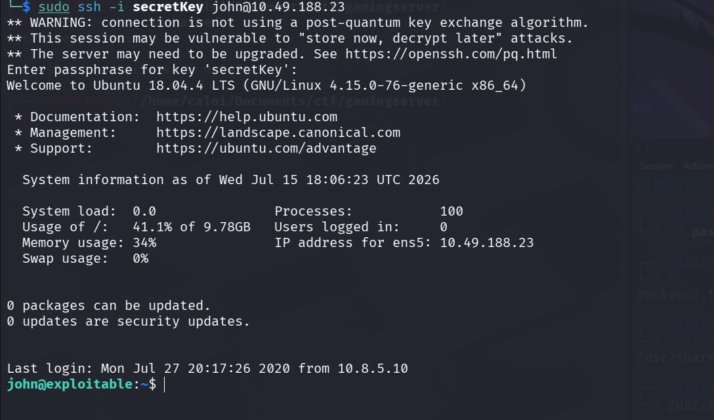

---

## 4. Retrieving the User Flag and Privilege Escalation

After logging in, I retrieved the user flag located in the current user's directory.

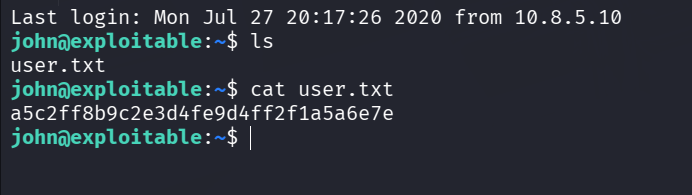

Checking the user's group memberships revealed that the account belonged to the `lxd` group.

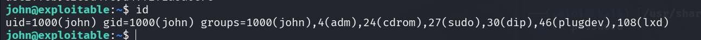

There is a well-known privilege escalation technique involving LXD containers, so I decided to use it.

First, I downloaded the LXD Alpine Builder repository on my local machine.

```bash
git clone https://raw.githubusercontent.com/saghul/lxd-alpine-builder/master/build-alpine.git
```

After downloading it, I navigated to the Alpine directory and executed the build script.

```bash
chmod +x build-alpha
./build-alpha
```

Once the build process completed, it generated a `.tar.gz` Alpine image. I then transferred the file to the target machine using SCP.

```bash
scp -i secretKey /home/myname/Documents/ctf/gamingserver/lxd-alpine-builder/alpine-v3.13-x86_64-20210218_0139.tar.gz john@target-ip:/tmp
```

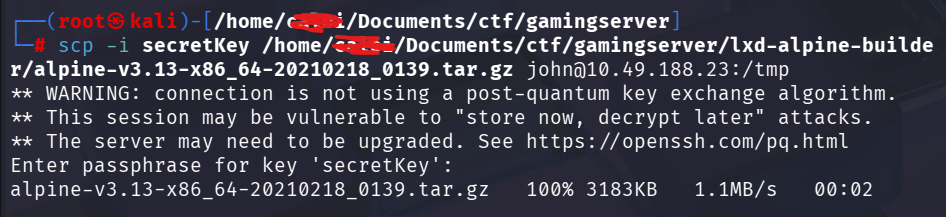

Returning to the target machine, I navigated to the `/tmp` directory and prepared the privilege escalation script. The exploit was obtained from ExploitDB.

```text
https://www.exploit-db.com/exploits/46978
```

Copy the contents of the exploit script from ExploitDB.

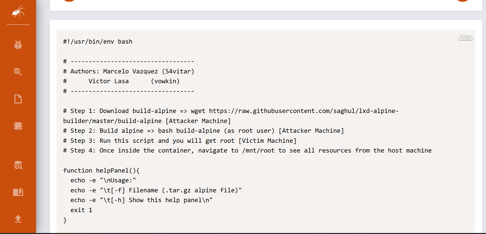

Create a new Bash script inside the `/tmp` directory and paste the exploit code into it.

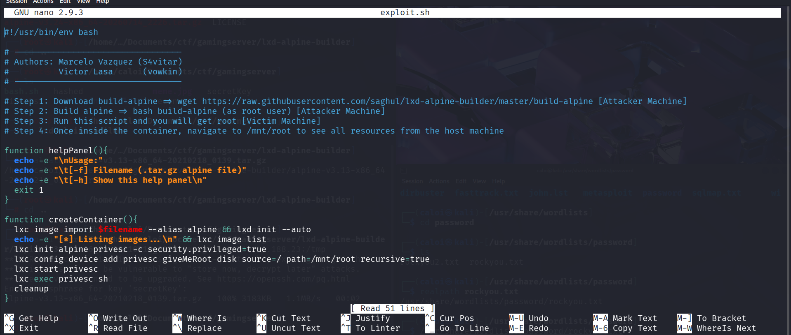

Make the script executable.

```bash
chmod +x exploit.sh
```

Finally, execute the script and provide the Alpine image as an argument.

```bash
./exploit.sh -f alpine-v3.13-x86_64-20210218_0139.tar.gz
```

The exploit successfully granted root access to the machine.


---

## 5. Retrieving the Root Flag

To locate the root flag, I searched for the file using `find`.

```bash
find | grep root.txt
```

The command revealed the location of the root flag.

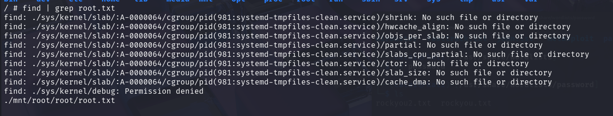

After navigating to the appropriate directory, I successfully retrieved the root flag.

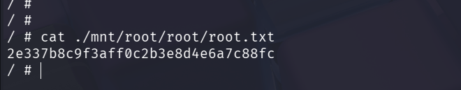

---

# Additional (Website Defacement)

As an additional demonstration of the impact of obtaining root privileges, I modified the contents of the web server and defaced the website.

First, navigate to the web server's document root.

```bash
cd /mnt/root/var/www/html
```

Rename the original `index.html` file to preserve a backup.

```bash
mv index.html index.html.old
```

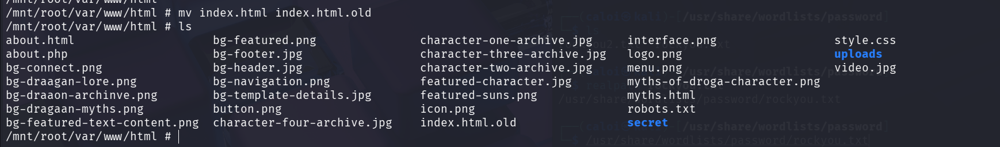

Next, create a new `index.html` file containing your custom HTML content.

```bash
touch index.html
echo "HTML CONTENTS" > index.html
```

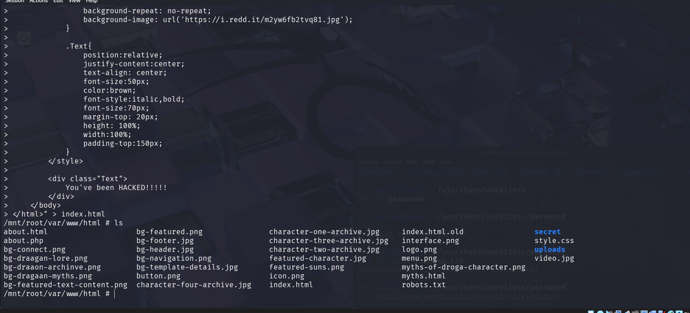

After saving the file, refreshing the webpage shows the modified website.

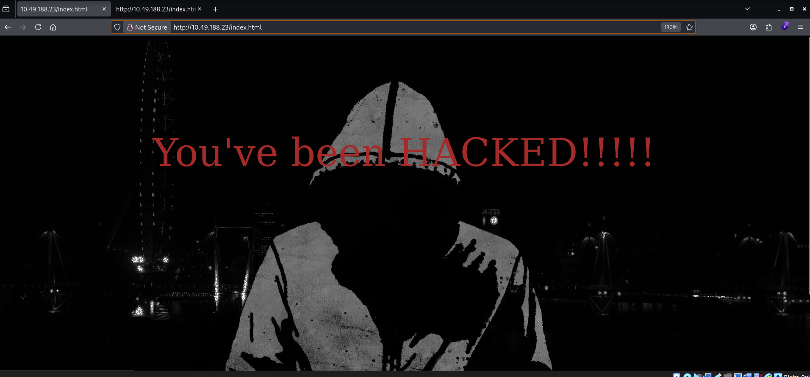
