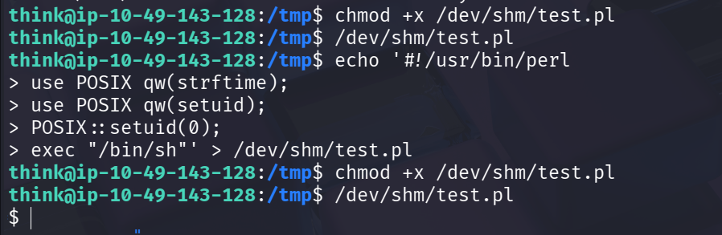
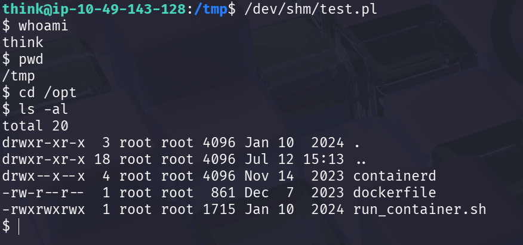
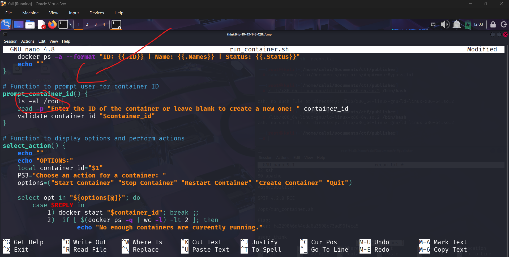
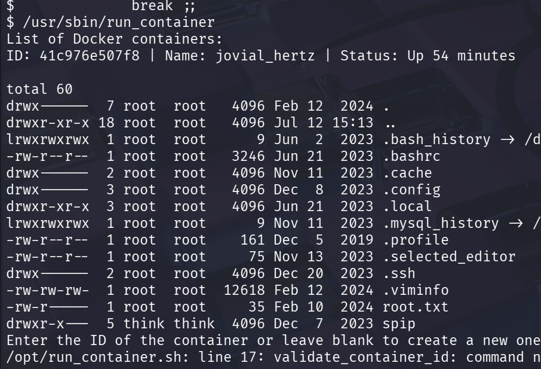
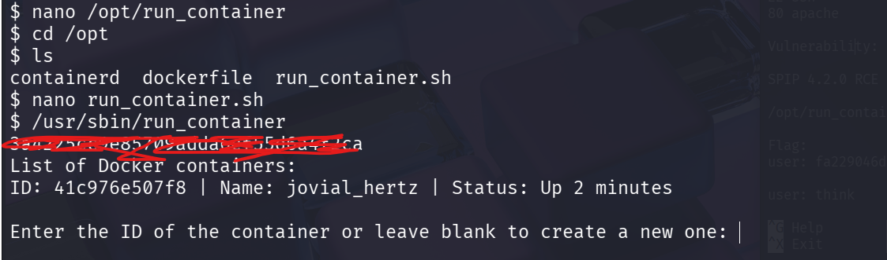

# Title: Publisher

**Difficulty:** Easy

**Category:** Red

## 1. Recon

I started by launching an Nmap scan against the target.

```bash
nmap -sV -sC target-ip
```


The scan reveals that two ports are open: **22**, running SSH, and **80**, running an Apache web server.

```Results
PORT   STATE SERVICE
22/tcp open  ssh
80/tcp open  http
```

Since an Apache web server is running, I proceeded to explore the website. I was greeted with what appeared to be a dead-end homepage. Clicking links such as **About** and **Contact Us** did not lead anywhere, while other sections such as **Blogs** redirected to external websites that were unrelated to the challenge.


Since the web application did not reveal much information, I used Gobuster to enumerate hidden directories.

```bash
gobuster dir -w wordlist.txt -u target-ip
```

After trying multiple wordlists, Gobuster discovered an interesting endpoint named **spip**.


Visiting the endpoint revealed a page with a search function. Since the search input reflected my input back to the page, I suspected it might be vulnerable to XSS. However, after testing it, I found that the input was properly sanitized.


I then checked the application using Wappalyzer, which identified the web application as running **SPIP CMS version 4.2.0**.


# 2. Exploitation

Knowing the CMS version, I checked whether Metasploit contained an exploit for **SPIP 4.2.0**.

```bash
msfconsole
searchsploit spip
```

Fortunately, an exploit was available that provided remote code execution against the target.


After configuring the required options, I executed the exploit and successfully obtained a Meterpreter session.


While exploring the filesystem, I located the user flag along with an RSA private key that could be used to SSH into the server.


Before using the key, I changed its permissions so that SSH would accept it.

```bash
chmod 600 id_rsa
```

I then logged into the machine as the user **think**.

```bash
ssh -i id_rsa think@target-ip
```

Since I could not use `sudo -l` to enumerate potential privilege escalation paths, I searched for SUID binaries instead.

```bash
find / -perm -u=s -type f 2>/dev/null
```

Among the results, one unusual binary stood out: `/usr/sbin/run_container`.


After executing the binary and examining it with `strings`, it appeared to execute a script named `run_container.sh` located inside the `/opt` directory.


At this point, I was unsure how to proceed because I did not have permission to access the `/opt` directory. To gather more information, I transferred **LinPEAS** to the target using SCP and executed it from the `/tmp` directory.

```bash
scp -i id_rsa linpeas.sh think@10.49.143.128:/tmp/
```

```bash
chmod +x linpeas.sh
./tmp/linpeas.sh
```

After running LinPEAS, I discovered that the machine was protected by **AppArmor**, which was preventing access to the `/opt` directory.

After some research, I came across an older AppArmor bypass and used the following Perl script:

```bash
echo '#!/usr/bin/perl
use POSIX qw(strftime);
use POSIX qw(setuid);
POSIX::setuid(0);
exec "/bin/sh"' > /dev/shm/test.pl
chmod +x /dev/shm/test.pl
/dev/shm/test.pl
```

The script spawned a shell that bypassed the AppArmor restrictions, allowing me to access the `/opt` directory.




Now that I could modify the script, I edited `/opt/run_container.sh` and added commands that would allow me to read the contents of the root directory.



I then executed the SUID binary, which ran the modified script.

```bash
/usr/sbin/run_container
```

This allowed me to view the contents of the root directory. Finally, I modified the script once more so that it would display the root flag.



The script successfully revealed the root flag.


