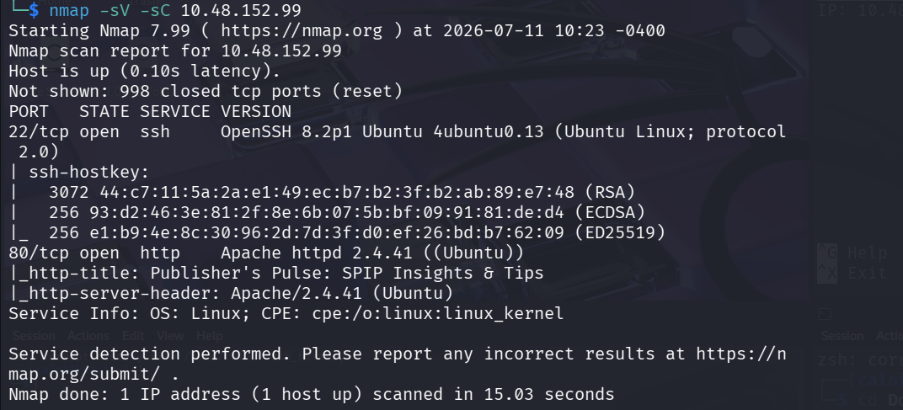
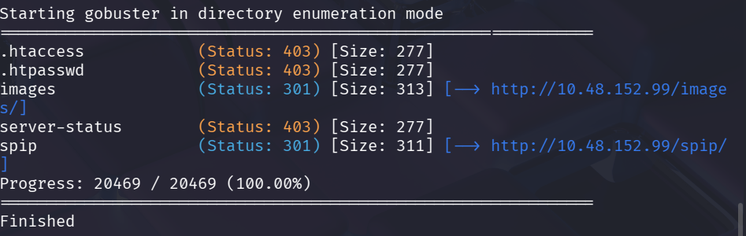
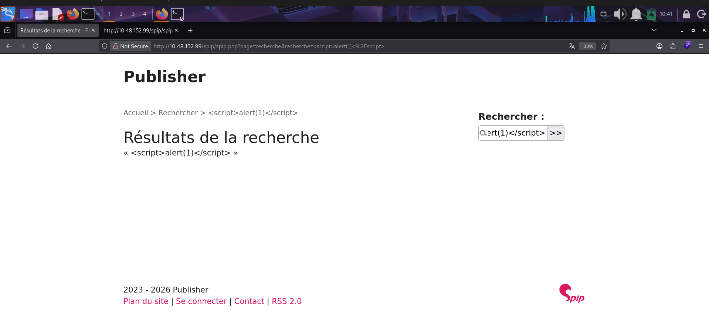
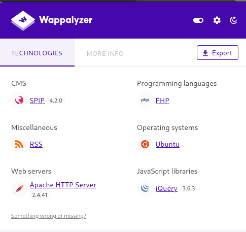
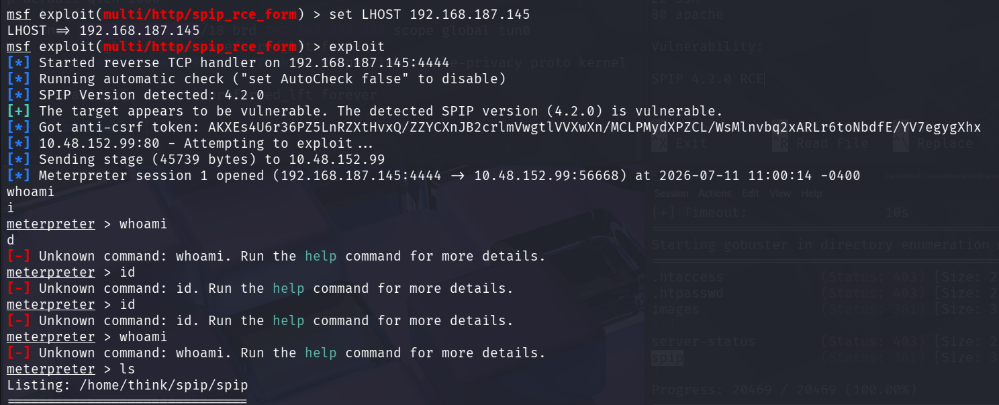
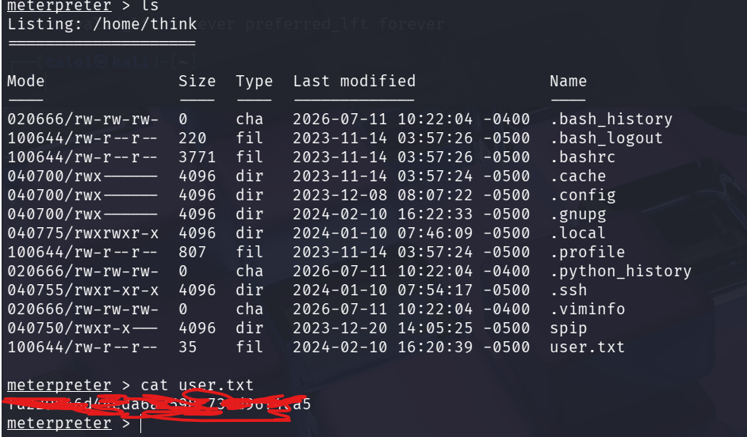
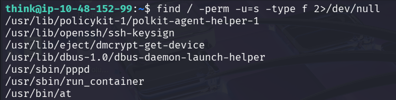
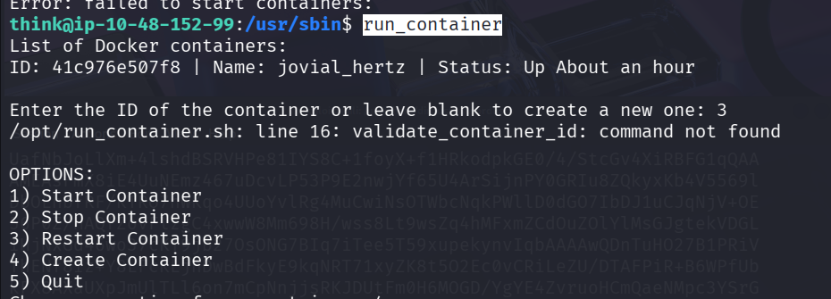

# Title: Publisher
**Difficulty:** Easy

**Category:** Red

## 1. Recon

I start by launching an nmap scan on the target

```bash
nmap -sV -sC target-ip
```



It reveals two ports are open, port 22 which is running an ssh and 80 running an apache service

```Results
PORT   STATE SERVICE
22/tcp open  ssh
80/tcp open  http
```

Since we know an apache service is running. Let us explore the web app. We are then greeted with a dead end website. Clicking sections like About, Contact Us and etc does not lead to any web pages, although clicking other sections like blogs redirects us to differet websites which are irrelevant to the challenge


let us run gobuster to look for hidden web pages.

```bash
gobuster dir -w wordlist.txt -u target-ip
```

After testing multiple wordlists while enumerating it found a suspicious endpoint called "spip"



When visiting the web we got a page that has a search function, Since using the search function reflects the characters you typed. I suspected that maybe its vulnerable to XSS, but unfortunately the input is sanitized



Upon checking wappalizer, it is mentioned that its running an SPIP cms with the version 4.2.0



# 2. Exploitation

I checked metasploit if an exploit is available against spip 4.2.0

```bash
msfconsole
searchsploit spip
```

Luckily there is an exploit that grants us RCE against the target.


I then ran the exploit by setting the appropriate options and I was then given a meterpreter session



After exploring the file system I was then able to retrieve the user flag and also an rsa key so we could ssh to the server.



after getting the rsa change the permission to readable so we could use it to ssh into the machine

```bash
chmod 600 id_rsa
```

Finally ssh into the machine as the user "think" and we're in.

```bash
ssh -i id_rsa think@target-ip
```

Since we cannot run sudo -l to check SUID we can use another command

```bash
find / -perm -u=s -type f 2>/dev/null
```

After checking there is an unusual file /usr/sbin/run_container



When running the container it and checking it with strings, it looks like its executing running_container script from /opt directory

