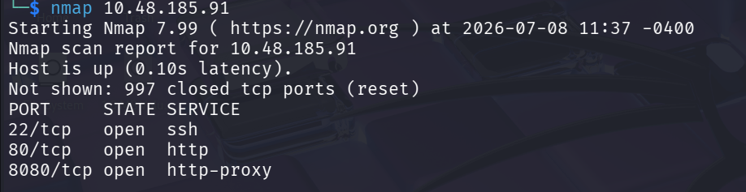
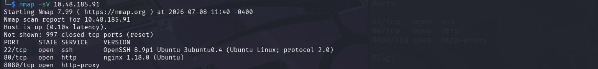
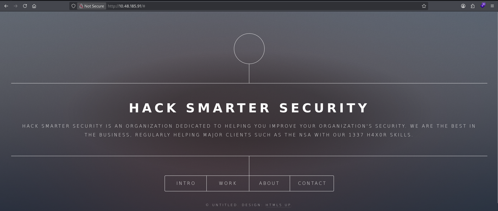
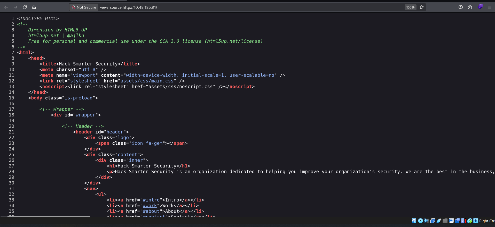
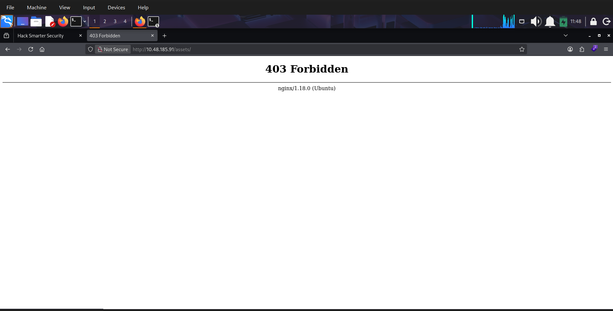
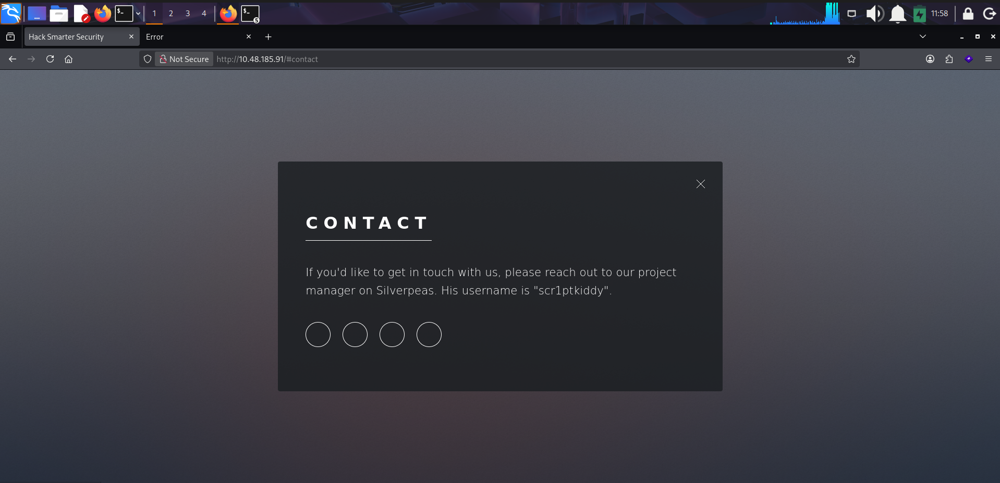
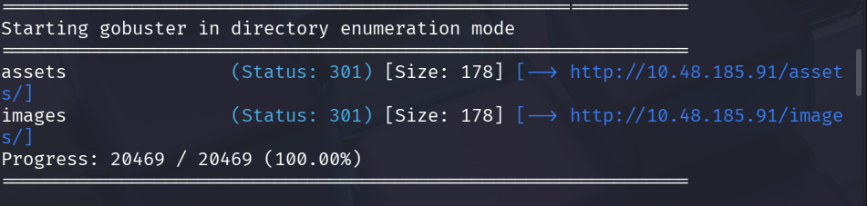
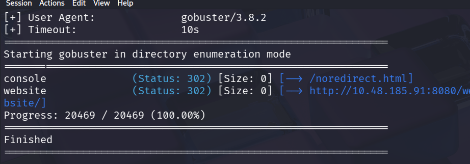

# Title: Silver Platter

**Difficulty:** Easy

**Category:** Red

## 1. Reconnaissance

I start by launching Nmap on the target machine to know what services and ports are running

```bash
nmap 10.48.185.91
```



Now that we know that there 3 ports are running

22/tcp   open  ssh
80/tcp   open  http
8080/tcp open  http-proxy

Let us run another nmap scan but with an -sV flag to know what versions of services are running in that port.

```bash
nmap -sV 10.48.185.91
```



It looks like their web is running an nging 1.18.0 proxy, let is keep that in mind later

## 2. Exploring the Web Application







While exploring their web in the Contact page, they mentioned about a username "scr1ptkiddy" and a project "Silverpeas" we will list it down. Other than that the website is also not vulnerable to directory listing and nothing interseting in the source code



## 3. Enumeration

I used gobuster to fuzz the possible directories of the website using the common.txt, big.txt wordlist.

```bash
gobuster dir -w common.txt -u 10.48.185.91
```

Gobuster found nothing interesting on the websites that are hosted in port 80 and 8080. I even checked the website and console directory from the website hosted in 8080 but it only gave a 403.





Then I remember theres a project called "Silverpeas" that was mentioned on the Contacts page and when I entered it as a directory. It exists on the website in 8080. 

We are greeted with a login page. I tried using an SQL Injection and it is not vulnerable to it


Since we already have a username "scr1ptkiddy" all thats left is the password.